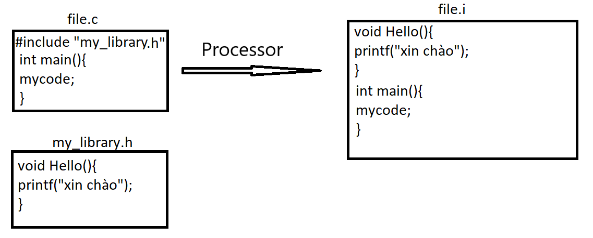
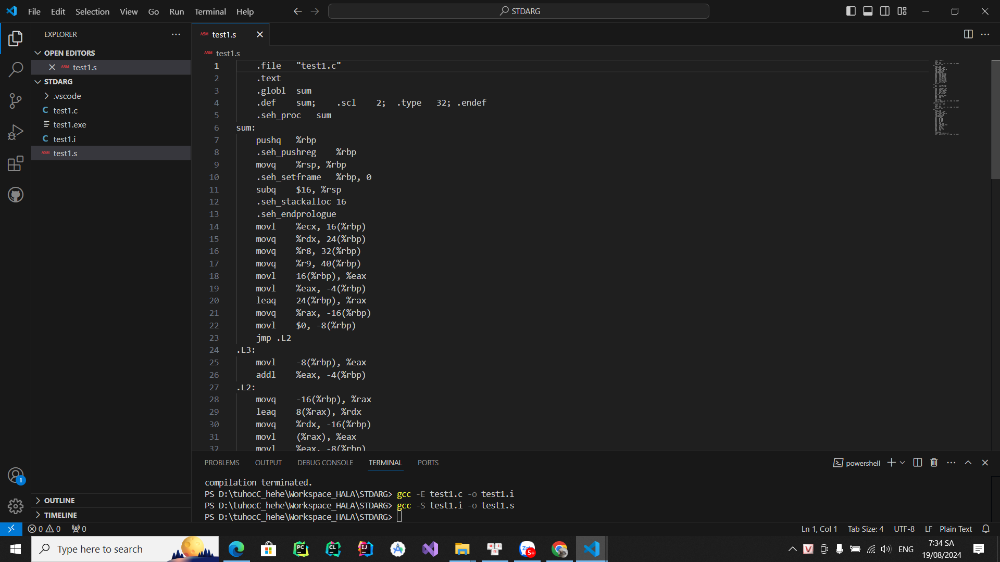
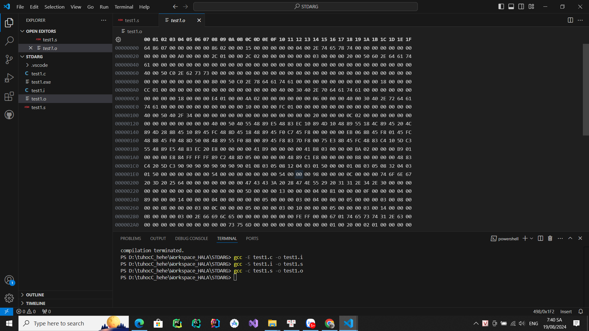
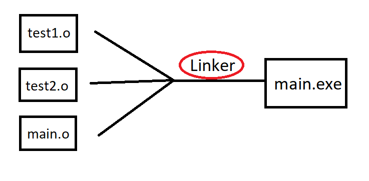
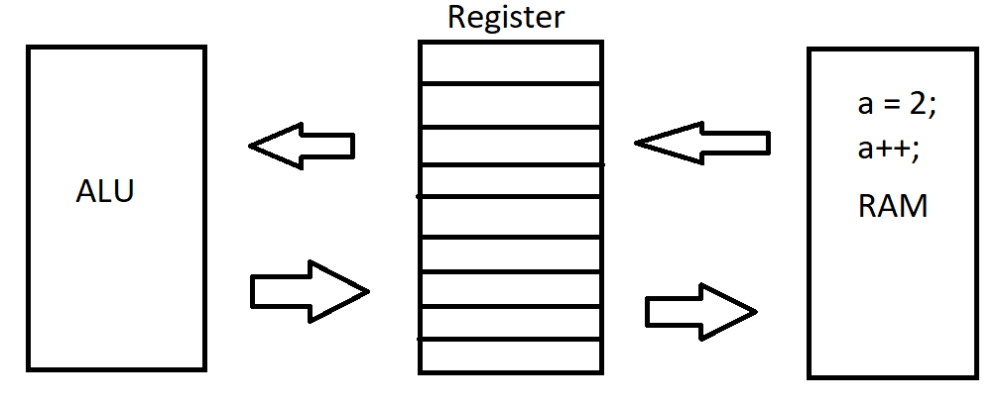
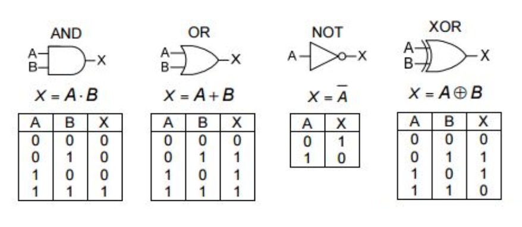
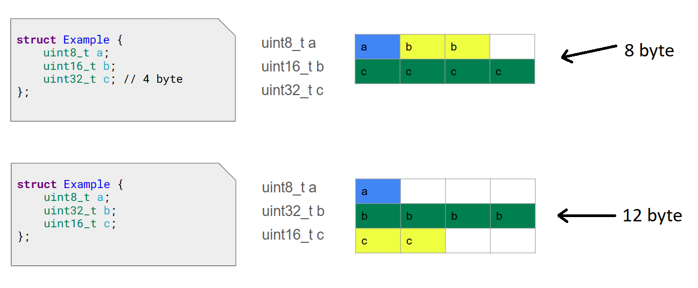
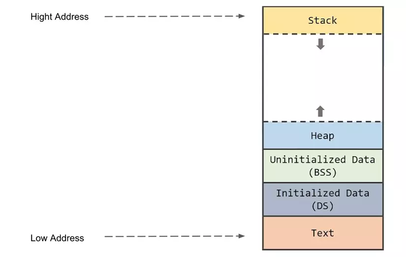

# Bài 1:  Compiler - Macro
## 1, Compiler 
+ Compiler là một quá trình biến đổi từ file source code người dùng viết ra thành một file nào đó mà máy tính có thể hiểu và thực thi được.

**Để hiểu rõ hơn thì hình dưới đây sẽ thể hiện 4 bước của quá trình Compiler:**


Ở ***bước 1 là quá trình Preprocessor*** sau khi chúng ta viết được một source code (.c, .cpp, .h) sau khi qua bước này file source sẽ chuyển thành file (.i)

Câu lệnh ở đây sẽ là: ` gcc -E file.c -o file.i `
+  Ở bước này file .i xóa bỏ tất cả chú thích, comments của chương trình cũ 
+ Mấy cái code trong file thư viện #include cũng được dán vào hết file .i
+ Các định nghĩa của #define cũng được dán vào những nơi đã được sử dụng trong file .i

Ví dụ như hình dưới đây:


Ở ***bước 2 là quá trình Compiler*** sau khi đã có file .i chương trình tiếp tục chuyển file .i thành file .s được gọi là Assembly code là một ngôn ngữ gần với ngôn ngữ máy nhất.

Câu lệnh ở đây sẽ là: ` gcc -S file.i -o file.s `
File nó sẽ có kiểu như hình dưới đây


Ở ***bước 3 là quá trình assembler*** sau khi đã có file assembly code (.s) chương trình tiếp tục chuyển file .s thành file .o Để dễ hiểu thì file .o là file code mà máy tính có thể hiểu được và trong file này thì chỉ toàn là mã máy 0 và 1. File nó sẽ có kiểu như hình dưới đây:

Câu lệnh ở đây sẽ là:` gcc -c file.s -o file.i `
  

Ở ***bước  là quá trình Linker*** Sau khi thực hiện các bước phía bên trên chúng ta sẽ có một đống file .o thì nhiệm vụ bây giờ chúng ta phải hợp nhất chúng lại thành một file duy nhất để máy tính có thể chạy được và đó là tác dụng của quá trình linker, chúng sẽ liên kết tất cả file .o lại thành 1 file .exe duy nhât để có thể thực thi chương trình hoàn chỉnh.

Câu lệnh ở đây sẽ là:` gcc file1.o file2.o file3.o -o output.exe`


Đây cũng chỉ là quá trình liên kết nhiều file.o lại với nhau nên định dạng của file.exe cũng chỉ là mã máy 0 và 1.


## 2,Macro
Hiểu đơn giản thôi thì ***Macro*** là những thứ được định nghĩa trước quá trình Preprocessor diễn ra như: các thư viện được thêm vào #include, hoặc là các định nghĩa được viết vào #define.
Thư viện **#inlcude** thì hiểu đơn giản đó là một file code khác được dán vào chương trình của mình là mình có thể sử dụng các thứ được viết sẵn trong file code đó ra để sử dụng.
+ Có hai loại include: 
  + ` #include <file> ` có dấu ngoặc nhọn thì preprocessor sẽ được dẫn tới Include Directory của Compiler.
  + ` #include "file" ` sử dụng dấu ngoặc kép thì preprocessor sẽ tìm kiếm file trong thư mục cùng chứa với file chương trình của bạn.

**#define** hiểu đơn giản như là thay thế một đoạn code này bằng một cái tên khác cho dễ đọc và dễ hình dung hơn, và giúp chương trình dễ bảo trì.
ví dụ:
``` C
#inclde <stdio.h>
#define SIZE 100
int main()
{
printf(“ size is %d”, SIZE);
return 0;
}
```
Output: ` size is 100`

Hoặc macro có thể được viết nhiều dòng bằng cách sử dụng dấu ‘\’. như hình dưới:
``` C
#include <stdio.h>
#define PRINT(i,n) while (i<n)     \
{                  \
printf(“XinChao”);   \
i++;               \
}

int main()
{
int i=0;
PRINT(i,3);
return 0;
}
```
Output: ` XinChaoXinChaoXinChao`

**Token-Pasting** được truyền cho các macro có thể được nối bằng cách sử dụng toán tử ##. Nó sẽ giống kiểu nối chuỗi lại với nhau á mà. Ở đây ta có ví dụ lun cho nóng.
``` C
#include <stdio.h>
#define merge(X,Y) X##Y
int main()
{

printf(“%d\n”,merge(12, 34));
return 0;

}
```
Output: ` 1234`

Ngoài #define chúng ta còn có **#undef** dùng để định nghĩa lại các macro đã định nghĩa trước đó.
``` C
#include <stdio.h>
#define NUMBER 212
int main()
{

printf(“%d\n”, NUMBER);
#undef NUMBER
#define NUMBER  100;
   printf(“%d”, NUMBER);
return 0;

}
``` 
Output: ` 100 `

Ngoài ra còn có **#if, #elif, #else** thì nó cũng giống như các lệnh if else sài bình thương thôi, nó sẽ dựa theo các #define đã định nghĩa ở trước đó để thực hiện các điều kiện đúng. Nhớ phải có **#endif** nữa nha.
ví dụ:
``` C
#include <stdio.h>
#define NUMBER 3
int main()
{

#if NUMBER >= 2
printf(“Hello World!!!”);
#else
printf(“No define”);
#endif

}
``` 
Output: ` Hello World!!!`


Chỉ thị tiền xử lý **#ifdef, #ifndef** được hiểu đơn giản là đã được định nghĩa hoặc là chưa được định nghĩa. Với #ifdef thì nếu một #define trong điều kiện của #ifdef đã được định nghĩa thì nó sẽ thực hiện các câu lệnh trong điều kiện còn không thì chương trình sẽ không thực hiện nữa. Còn với #ifndef thì ngược lại, nếu một #define trong điều kiện của #ifndef chưa được định nghĩa thì nó sẽ thực hiện các câu lệnh trong điều kiện còn nếu đã được định nghĩa rồi thì nó sẽ không thực hiện nữa. Với #ifndef thì được sử dụng như là tránh các lỗi liên quan tới việc chèn thư viện bị trùng nhau trong một file.

Ta có một ví dụ sau: Nếu macro MATH_H đã được define trước đó thì ifndef không thực hiện gì cả, còn nếu nó chưa được define trước đó thì nó sẽ define MATH_H và thực hiện các lệnh ở dưới như bình thường:
``` C
#include <stdio.h>
#ifndef MATH_H
#define MATH_H
#include <math.h>
int main()
{

int a=9;
printf(“%d”, sqrt(a));

}
#endif
``` 
Output: ` 3.0000`

**Variadic macro** Là một dạng macro cho phép nhận một số lượng biến tham số có thể thay đổi. Giúp định nghĩa các macro có thể xử lý một lượng biến đầu vào khác nhau.
**Variadic macro** được định nghĩa bằng cách sử dụng dấu ba chấm (...) trong phần định nghĩa của macro. Sau đây là một ví dụ cơ bản:
``` C
#include <stdio.h>
#include <stdarg.h>

#define tong(...) sum(__VA_ARGS__, 0)

int sum(int labels, ...)
{
    va_list va;
    int sum = labels;
    va_start(va, labels);
    int value = 0;
    while ((value = va_arg(va, int)) != 0)
    {
        sum += value;
    }
    va_end(va);
    return sum;
}

int main()
{
    printf("tong = %d", tong(1, 2, 3));
    return 0;
}
```
Ở đây, __VA_ARGS__ là các đối số truyền vào hàm sum.


# Bài 2: STDARG - ASSERT
## 1, Thư viện stdarg
Hiểu đơn giản là thư viện này giúp cung cấp các macro và định nghĩa cần thiết để làm việc với các hàm nhận số lượng đối số không cố định, hay còn gọi là hàm **variadic**. Thư viện này cho phép bạn khai báo các hàm có thể nhận số lượng đối số tùy ý và xử lý chúng một cách linh hoạt.
#### Chức năng của các hàm trong thư viện 
+ **va_list** Đây là một kiểu dữ liệu được định nghĩa trong **stdarg.h**. Nó là một kiểu dùng để khai báo một biến mà sau đó sẽ được sử dụng để truy cập các đối số biến đổi trong một hàm. 
+ **va_start** thì là một hàm dùng để nhận biết nơi bắt đầu đọc các biến có thể thay đổi và được đánh dấu bằng một nhãn kiểu char.
+ **va_arg** truy cập từng đối số trong danh sách các đối số biến đổi được tính từ cái nhãn  và ép kiểu chúng từ kiểu char về kiểu mong muốn, ví dụ kiểu int, float,... Mỗi lần gọi va_arg, macro này sẽ trả về giá trị của đối số tiếp theo và tự động di chuyển đến đối số tiếp theo.
+ **va_end** dùng thể thu hồi con trỏ đã được khai báo của kiểu dữ liệu va_list.

ví dụ khi sử dụng thư viện 
``` C
int sum(int count, ...) {
    int total = 0;
    // Tạo ra con trỏ va dùng để truy cập các đối số biến đổi trong hàm sum
    va_list va; 

    // Khởi tạo danh sách các đối số với va, bắt đầu từ đối số sau count.
    va_start(va, count);

    for (int i = 0; i < count; i++) {
    // Truy cập từng đối số trong danh sách, mỗi lần lấy một đối số kiểu int. 
        total += va_arg(va, int);
    }
    // Thu hồi con trỏ đã được khai báo
    va_end(va);
    return total;
}
``` 

## 2, Thư viện assert
Hiểu đơn giản thì thư viện này nó giống như if else, có tác dụng kiểm tra một điều kiện nhưng đặc biệt ở chỗ nếu điều kiện sai thì nó sẽ trả về một thông điệp lỗi và cho biết điều kiện sai ở nơi nào.
ví dụ khi sử dụng:
``` C
#include <stdio.h>
#include <assert.h>

int divide(int a, int b) {
    assert(b != 0);  // Kiểm tra điều kiện: mẫu số không được bằng 0
    return a / b;
}

int main() {
    int a = 10, b = 0;

    // Gọi hàm divide, đây sẽ dẫn đến lỗi vì mẫu số là 0
    int result = divide(a, b);

    printf("Kết quả: %d\n", result);
    return 0;
}

``` 
Output: ` assertion "b != 0" failed: file "D:\tuhocC_hehe\Workspace_HALA\STDARG\test1.c", line 5, function: divide ` 
Ta có thể thấy thư viện này in cho chúng ta biết đây là lỗi gì và ở dòng nào, hàm nào. Quá là đẳng cấp xịn sò.


# Bài 3: Pointer 
Hiểu đơn giản thì pointer nó cũng chỉ là một biến thôi, nhưng đặc biệt hơn thì biến này sẽ chỉ lưu địa chỉ của một đối tượng khác ví dụ như biến khác hoặc hàm khác,... Điều này giúp nó có thể truy suất tới địa chỉ của một đối tượng khác và có thể thay đổi giá trị của đối tượng đó.
Về kích thước size của con trỏ thì phụ thuộc vào kiến trúc của vi xử lý thôi
#### Các loại pointer 
**void pointer** là con trỏ có thể trỏ tới bất kì đối tượng nào mà không cần quan tâm kiểu dữ liệu của đối tượng đó là gì.Nhưng mà nếu muốn làm việc gì với biến đó thì phải ép kiểu nó về chính kiểu của biến đó.

Dưới đây là một ví dụ cơ bản về con trỏ void
``` C
#include <stdio.h>

void printValue(void *ptr, char type) {
    switch (type) {
        case 'i':  // Kiểu int
            printf("Giá trị int: %d\n", *(int*)ptr);
            break;
        case 'f':  // Kiểu float
            printf("Giá trị float: %f\n", *(float*)ptr);
            break;
        case 'c':  // Kiểu char
            printf("Giá trị char: %c\n", *(char*)ptr);
            break;
        default:
            printf("Kiểu không hợp lệ\n");
    }
}

int main() {
    int a = 10;
    float b = 5.5;
    char c = 'A';

    printValue(&a, 'i');
    printValue(&b, 'f');
    printValue(&c, 'c');

    return 0;
}
```

**Function Pointer** 
Hiểu đơn giản thì nó cũng là một biến, và nó sẽ lưu địa chỉ của hàm thui, nó khai báo như nào thì nó có thể trỏ tới một hàm y như vậy.

ví dụ: ` void (*ptr)(int, int) ` thì có thể trỏ tới ` void add(int a,int b) ` kiểu kiểu như vậy.
hoặc đẳng cấp hơn thì là dùng làm đối số cho một hàm ví dụ:
``` C
#include <stdio.h>

// Định nghĩa một vài hàm đơn giản
int add(int a, int b) {
    return a + b;
}

int subtract(int a, int b) {
    return a - b;
}

// Hàm sử dụng con trỏ hàm để thực hiện phép toán
void compute(int (*operation)(int, int), int x, int y) {
    int result = operation(x, y);
    printf("Kết quả là: %d\n", result);
}

int main() {
    // Khai báo và gán con trỏ hàm
    int (*func_ptr)(int, int);

    // Gán hàm add cho con trỏ hàm
    func_ptr = add;
    compute(func_ptr, 5, 3);  // Kết quả là 8

    // Gán hàm subtract cho con trỏ hàm
    func_ptr = subtract;
    compute(func_ptr, 5, 3);  // Kết quả là 2

    return 0;
}

```

**Pointer to Constant** hiểu đơn giản là một con trỏ sẽ trỏ tới một đối tượng nhưng không thể thay đổi giá trị của đối tượng đó được mà chỉ có thể đọc giá trị của đối tượng đó mà thôi.
cú pháp: `int const *ptr = &value;`

Khi bạn truyền con trỏ đến hằng vào một hàm, bạn đảm bảo rằng hàm đó sẽ không thể thay đổi dữ liệu gốc. Điều này rất quan trọng trong các tình huống khi bạn chỉ muốn một hàm đọc dữ liệu mà không thay đổi nó.

ví dụ:
``` C
void printArray(const int *arr, int size) {
    for (int i = 0; i < size; i++) {
        printf("%d ", arr[i]);
    }
}
/*hàm printArray nhận một con trỏ đến hằng arr. Điều này đảm bảo rằng hàm chỉ có thể
đọc dữ liệu từ mảng arr và không thể thay đổi nó.*/

```
**Constant pointer** hiểu đơn giản thì nó là một con trỏ nhưng chỉ được phép trỏ tới một cái địa chỉ duy nhất. Trong các hệ thống nhúng, nơi các con trỏ có thể trỏ đến các địa chỉ cố định trong bộ nhớ, việc sử dụng con trỏ hằng giúp đảm bảo rằng con trỏ sẽ luôn trỏ đến đúng vị trí bộ nhớ mà không bị thay đổi.
cú pháp: `int *const ptr = &value;`

ví dụ: Giả sử bạn có một thanh ghi điều khiển LED trên một vi điều khiển và bạn muốn viết một giá trị vào thanh ghi này để điều khiển LED. Bạn có thể sử dụng con trỏ hằng để đảm bảo rằng địa chỉ của thanh ghi này không bị thay đổi.
```C
#include <stdio.h>
#include <stdint.h>  // Để sử dụng các kiểu dữ liệu chính xác

// Địa chỉ của thanh ghi điều khiển LED (giả sử ở địa chỉ 0x40021000)
#define LED_CONTROL_REGISTER  ((volatile uint32_t *)0x40021000)

// Hàm để bật LED
void turnOnLED() {
    // Sử dụng con trỏ hằng để trỏ đến địa chỉ thanh ghi
    const uint32_t * const ledReg = LED_CONTROL_REGISTER;
    
    // Viết giá trị vào thanh ghi để bật LED
    *ledReg = 0x1;  // Giả sử giá trị 0x1 bật LED
}

int main() {
    turnOnLED();
    // Các mã khác
    return 0;
}

```

**Pointer to Pointer** hiểu đơn giản thì nó là một con trỏ cấp 2, nghĩa là nó sẽ trỏ tới một con trỏ khác cấp 1, và tất nhiên là nó sẽ thay đổi được giá trị của con trỏ mà nó trỏ tới.

Dưới đây là một số ví dụ cụ thể để minh họa cách sử dụng con trỏ đến con trỏ:
```C
#include <stdio.h>

int main() {
    // Khai báo và khởi tạo một mảng con trỏ
    int a = 10;
    int b = 20;
    int c = 30;
    int *array[3] = { &a, &b, &c }; // Mảng con trỏ

    // Khai báo một con trỏ đến con trỏ và trỏ đến mảng con trỏ
    int **ptr = array;

    // Duyệt và in giá trị của mảng con trỏ thông qua con trỏ đến con trỏ
    for (int i = 0; i < 3; i++) {
        printf("Giá trị tại ptr[%d] = %d\n", i, *ptr[i]);
    }

    return 0;
}

```

**NULL pointer** là con trỏ không trỏ tới bất kì một địa chỉ nào cả. Hiểu đơn giản là nếu chúng ta khai báo một con trỏ mà chưa cần sử dụng nó thì phải gán nó bằng **NULL** bởi vì nếu không gán bằng **NULL** rất có thể nó sẽ trỏ tới một địa chỉ bất kì trong chương trình và có thể gây xung đột biến. ``` 
int *ptr = NULL;``` 

# Bài 4: Extern - Static - Volatile - Register

## 1,Biến Extern
Tại sao phải sử dụng biến này? Biến này khác gì so với **#include**
**#include** được sử dụng để chèn nội dung tệp tiêu đề vào tệp nguồn và để khai báo các hàm, biến, hoặc cấu trúc mà bạn sẽ sử dụng trong tệp nguồn đó.

**extern** được sử dụng để khai báo rằng một biến hoặc hàm đã được định nghĩa ở nơi khác, và bạn muốn sử dụng nó mà không định nghĩa lại.  Khi bạn khai báo một biến với từ khóa **extern**, bạn đang nói với trình biên dịch rằng biến này đã được định nghĩa ở một nơi khác, và bạn chỉ đang tham chiếu đến nó. Ta có ví dụ sau đây:

```C
// file1.c
int x = 10;  // Định nghĩa biến x

// file2.c
extern int x;  // Tham chiếu đến biến x đã được định nghĩa ở file1.c

```
Chú ý: ***Một lưu ý nữa là đối với các hàm thì cũng có tác dụng tương tự như vậy***

Nếu bạn định nghĩa biến toàn cục trong file header và sử dụng #include nó ở nhiều tệp nguồn khác nhau, bạn sẽ gặp lỗi liên kết do việc định nghĩa cùng một biến nhiều lần.

Và **#ifndef** không có tác dụng trong trường hợp này nha bởi vì là #ifndef chỉ có tác dụng trong 1 file thôi, còn nếu ta #include trong nhiều tệp nguồn khác nhau nó sẽ bị lỗi ở quá trình linker á.

ví dụ:
```C
// myheader.h
int x = 10;  // Định nghĩa biến x

// file1.c
#include "myheader.h"

// file2.c
#include "myheader.h"  // Lỗi do x đã được định nghĩa ở cả file1.c và file2.c
```

Nói chung là việc kết hợp đúng giữa **#include** và **extern** giúp bạn viết mã nguồn dễ bảo trì và tránh được các lỗi biên dịch không mong muốn.

## 2, Biến Static

Trong ngôn ngữ lập trình C, từ khóa static có nhiều ứng dụng khác nhau, tùy thuộc vào ngữ cảnh mà nó được sử dụng. static có thể được áp dụng cho biến cục bộ, biến toàn cục, và hàm. Nhưng hiểu đơn giản thì các bạn có thể hiểu là biến static được khai báo ở đâu thì nó chỉ có thể sử dụng trong đúng cái block đó thôi. Và biến static thì dù khai báo ở đâu thì nó luôn luôn được lưu ở vùng data trong **memory layout** nên là dù nó có khai báo với chức năng local thì nó cũng không bị mất đi giá trị sau mỗi lần gọi hàm.
Sau đây chúng ta sẽ đi chi tiết về các loại biến static:

**1, Biến static local**
Như đã nói ở trên thì biến static sẽ không bị mất giá trị sau mỗi lần gọi hàm. Thông thường, các biến cục bộ sẽ được khởi tạo lại mỗi khi hàm được gọi, nhưng với static, biến chỉ được khởi tạo một lần duy nhất và giữ nguyên giá trị của nó cho đến khi chương trình kết thúc.

ví dụ:
```C
void count() {
    static int counter = 0;  // Chỉ được khởi tạo một lần
    counter++;
    printf("%d\n", counter);
}

int main() {
    count();  
    count();  
    count();  
    return 0;
}
```
`Output 1`     `2`  `3`
**2, Biến static global**
Như đã nói ở trên thì biến static được khai báo ở đâu thì nó chỉ có thể sử dụng trong cái block đó thôi, vậy nên biến static global được khai báo thì có thể sử dụng trong toàn tệp tin mà nó định nghĩa, nhưng nó không thể được truy cập từ bất cứ 1 file nào khác cho dù là sử dụng từ khóa extern.

ví dụ:
```C
// file1.c
static int x = 10;  // Chỉ có thể truy cập trong file1.c

// file2.c
extern int x;  // Lỗi: không thể truy cập biến x trong file1.c

```
**3, Hàm static**
Đối với hàm thì nó cũng tương tự như biến static global thôi không khác gì cả. Điều này ngăn chặn hàm không thể bị truy cập từ các tệp tin khác

ví dụ:
```C
// file1.c
static void myFunction() {
    printf("Hello from static function\n");
}

// file2.c
extern void myFunction();  // Lỗi: không thể truy cập hàm myFunction trong file1.c
```
**4,Ứng dụng cụ thể của biến static trong các dự án lập trình lớn**
Đối với biến **static local** thì cho phép biến trong hàm giữ giá trị của nó mà không phải sử dụng biến toàn cục, giúp giữ cho mã nguồn gọn gàng và hạn chế phạm vi của biến.   

Ví dụ: Một hàm xử lý sự kiện có thể cần lưu trữ số lượng sự kiện đã xử lý mà không muốn tạo biến toàn cục:
```C
void processEvent() {
    static int eventCount = 0;
    eventCount++;
    printf("Processed %d events\n", eventCount);
}
```
Đối với biến **static global** và **hàm static** giúp tránh xung đột biến và hàm trong các modul dự án lớn. Bởi vì trong dự án nhiều file có thể đặt tên các biến giống nhau.

ví dụ: Giả sử bạn có hai module riêng biệt, mỗi module có một biến đếm
```C
// module1.c
static int counter = 0;
void incrementCounter1() {
    counter++;
    printf("Module 1 counter: %d\n", counter);
}

// module2.c
static int counter = 0;
void incrementCounter2() {
    counter++;
    printf("Module 2 counter: %d\n", counter);
}
```

Hoặc nếu bạn đã học tính đóng gói trong OOP thì biến static giúp ẩn thông tin chi tiết khi triển khai một hàm, để tranh việc ai đó có thể truy cập vô và sửa các chi tiết khiến hàm chính của chúng ta không còn được chính xác nữa.

Ví dụ: Bạn có thể có một hàm tiện ích hoặc biến hỗ trợ chỉ nên được sử dụng trong nội bộ một module, không muốn nó bị lộ ra ngoài
```C
// file_utils.c
static void helperFunction() {
    // do something
}

void publicFunction() {
    helperFunction();  // Sử dụng hàm tĩnh bên trong module
}
```

***Nhân tiện ở đây tui sẽ giải thích thêm về sự khác nhau giữa file.h và file.c***

**File.h** sẽ chứa các khai báo (declarations) như khai báo hàm, biến, macro, và các định nghĩa kiểu dữ liệu (struct, enum, typedef, v.v.). Chúng ta sẽ xem qua ví dụ ở đây để hiểu khai báo nghĩa là gì.
```C
int add(int a, int b);  // Khai báo hàm add với hai tham số kiểu int và trả về kiểu int

extern int x;  // Khai báo biến x, nhưng không cấp phát bộ nhớ cho nó
```
Vậy thì khai báo là việc thông báo cho trình biên dịch biết về sự tồn tại của một biến, hàm, hoặc kiểu dữ liệu mà không cung cấp toàn bộ thông tin chi tiết.

**File.c** chứa các định nghĩa (definitions) thực tế của hàm, biến, và các logic xử lý chương trình. Xem ví dụ dưới để hiểu thêm.
```C
int add(int a, int b) { // Cung cấp chi tiết cách hoạt động của hàm
    return a + b;
}
int x = 10;  // Định nghĩa biến x và cấp phát bộ nhớ cho nó với giá trị ban đầu là 10
```
Vậy thì định nghĩa là cung cấp toàn bộ thông tin chi tiết về một biến, hàm, hoặc kiểu dữ liệu, bao gồm cả việc cấp phát bộ nhớ (đối với biến) hoặc cung cấp nội dung chi tiết (đối với hàm).
## 3, Biến Volatile
Biến **volatile** rất quan trọng trong lập trình hệ thống nhúng, biến này chỉ ra cho trình biên dịch biết rằng là nó có thể thay đổi bất cứ lúc nào và trình biên dịch không cần thiết phải can thiệp tối ưu nó.

Bởi vì trình biên dịch có chức năng tối ưu biến, nghĩa là nếu trình biên dịch nhận thấy rằng một biến không hề bị thay đổi trong chương trình thì nó sẽ không quan tâm tới biến đó nữa, nhưng nếu biến đó đảm nhận một chức năng nào đó từ ngoại vi nó sẽ không được cập nhật kịp thời khiến chức năng của hệ thống bị sai.

ví dụ trong hệ thống nhúng:
```C
volatile int *statusUSB = (int *)0x40021000;  // Địa chỉ giả định của thanh ghi chứa trạng thái của USB
while (*statusUSB & 0x01 == 0) {
    // Chờ đến khi bit 0 của thanh ghi trạng thái được set
}
```
Ở đây, **statusUSB** trỏ tới một thanh ghi phần cứng mà giá trị của nó có thể thay đổi bất kỳ lúc nào bởi phần cứng. Từ khóa **volatile** đảm bảo rằng mỗi lần lặp, giá trị thực sự của thanh ghi được đọc từ bộ nhớ.

## 4, Biến register
Biến này được sử dụng trong trường hợp là biến này cần sử dụng nhiều và cần tốc độ truy cập nhanh nhất có thể. Các biến bình thường thì sẽ được lưu trữ ở Ram nhưng đối với biến Register sẽ được lưu trữ thẳng ở các thanh ghi điều này làm tăng tốc độ truy cập hơn rất nhiều. Ta có thể xem qua hình vẽ dưới đây để hiểu rõ hơn 



Hình vẽ này biểu thị việc xử lí tăng giá trị của biến a, nhưng nếu biến này lưu ở Ram thì quá trình này phải mất 4 bước kể từ lúc biến này được khai báo cho tới khi nó được tăng giá trị. Nó sẽ phải đi đến Register lưu giá trị rồi mới đi qua bộ tính toán ALU rồi sau đó mới chở về Register rồi mới trở về Ram. Nhưng nếu biến này được lưu trực tiếp ở Register thì nó sẽ chỉ mất 2 bước để thực hiện tính toán, điều này làm tăng đáng kể thời gian thực hiện chương trình.

**Các hạn chế khi sử dụng biến Register**

+ Bởi vì Ram thì nhiều nhưng Register thì ít nên việc tất cả các biến đều được sử dụng với từ khóa là Register là điều không thể. Người lập trình nên cân nhắc khi sử dụng biến Register.
+ **Không sử dụng với mảng hoặc biến có kích thước lớn**: Vì các thanh ghi có kích thước giới hạn, biến register không nên được sử dụng với mảng hoặc các cấu trúc dữ liệu lớn.
+ **Và một lưu ý nữa là** biến Register chỉ được khai báo dưới dạng local. Bởi vì các biến local chỉ tồn tại trong thời gian hàm chứa chúng đang thực thi. Khi hàm kết thúc, các biến này không còn tồn tại, và thanh ghi có thể được sử dụng cho các tác vụ khác. Điều này phù hợp với đặc tính của thanh ghi, vốn là tài nguyên có thời gian tồn tại ngắn và liên quan chặt chẽ đến luồng thực thi hiện tại.

ví dụ về 1 chương trình sử dụng biến Register
```C
void sumArray(int *arr, int size) {
    register int sum = 0;
    register int i;
    for (i = 0; i < size; i++) {
        sum += arr[i];
    }
    printf("Sum: %d\n", sum);
}
```

# Bài 5: Goto - setjmp.h 

## 1, Goto
**Goto** là gì? 
Đây là một từ khóa trong C, nó có tác dụng là sẽ nhảy tới vị trí một cái nhãn nào đó đã được tạo trước. Và Goto có tác dụng khá tốt khi có thể được dùng để thoát khỏi những vòng lặp một cách linh hoạt mà không phải sử dụng tới **break** nhiều lần. Xem ví dụ để dễ hiểu hơn.

```C
#include <stdio.h>

int main() {
    for (int i = 0; i < 5; i++) {
        for (int j = 0; j < 5; j++) {
            if (i == 2 && j == 3) {
                goto end_loops;  // Thoát khỏi cả hai vòng lặp
            }
            printf("i = %d, j = %d\n", i, j);
        }
    }

end_loops:
    printf("Đã thoát khỏi vòng lặp.\n");
    return 0;
}
```

**Lưu ý**: Và một lưu ý nhỏ ở đây là Goto chỉ có tác dụng ở local, có nghĩa là nó chỉ sử dụng được trong phạm vi 1 hàm nào đó, còn ở ngoài thì chịu chết nhá.

## 2, setjmp.h
Đây là một thư viện trong C thường được sử dụng để xử lý ngoại lệ và nó cung cấp cho người dùng 2 hàm chính đó là setjmp và longjmp.

**Trước tiên thì xử lí ngoại lệ có nghĩa là gì?**
**Xử lý ngoại lệ** (Exception Handling) là một cơ chế trong lập trình cho phép một chương trình phản ứng lại các tình huống bất thường hoặc lỗi xảy ra trong quá trình thực thi. Những lỗi này có thể là việc chia cho số 0, truy cập vào vùng nhớ không hợp lệ, lỗi I/O, hoặc các tình huống khác mà chương trình không thể dự đoán trước hoặc xử lý trong mã thông thường.

Vậy tác dụng của hàm thư viện setjmp là gì?
setjmp được dùng để quản lí quá trình nhảy tới mọi nơi trong chương trình (fix được các hạn chế của goto). Chúng cho phép bạn lưu trữ trạng thái của chương trình tại một thời điểm cụ thể và sau đó quay lại trạng thái đó từ bất kỳ vị trí nào trong mã. Để rõ hơn chúng ta sẽ đi tìm hiểu chức năng của hai hàm setjmp và longjmp rồi tới ví dụ.

**setjmp**: lưu trữ trạng thái hiện tại của môi trường chương trình vào một biến kiểu jmp_buf. Trạng thái này bao gồm các thông tin về con trỏ chương trình, ngăn xếp, và các biến cục bộ cần thiết để khôi phục trạng thái của chương trình sau này.
**longjmp**: Hàm longjmp được sử dụng để nhảy trở lại vị trí đã lưu bởi setjmp, khôi phục trạng thái môi trường đã được lưu trữ trước đó.

Chúng ta cùng xem qua ví dụ cụ thể để hiểu rõ hơn:
```C
#include <stdio.h>
#include <setjmp.h>

jmp_buf buf;

void second() {
    printf("Đang trong hàm second\n");
    longjmp(buf, 1);  // Nhảy trở lại vị trí setjmp
}

void first() {
    printf("Đang trong hàm first\n");
    second();  // Gọi hàm second
    printf("Điều này sẽ không bao giờ được in ra.\n");
}

int main() {
    if (setjmp(buf)) {
        printf("Đã nhảy trở lại từ hàm second\n");
    } else {
        printf("Gọi hàm first\n");
        first();  // Gọi hàm first
    }
    return 0;
}
```
Output:
```
Gọi hàm first
Đang trong hàm first
Đang trong hàm second
Đã nhảy trở lại từ hàm second
```
thư viện setjmp.h được ứng dụng rất nhiều trong nhúng trong việc xử lí các lỗi phần cứng. Giả sử bạn có một hệ thống nhúng điều khiển thiết bị cảm biến và bạn cần thực hiện một loạt các phép đo. Nếu xảy ra lỗi trong quá trình đọc dữ liệu từ cảm biến (ví dụ, cảm biến bị ngắt kết nối hoặc lỗi I/O), hệ thống cần khôi phục lại trạng thái trước đó mà không cần khởi động lại toàn bộ hệ thống.

**Một câu hỏi ở đây là việc sử lí lỗi của setjmp.h khác gì so với sử dụng thư viện assert.h?**
Hiểu đơn giản như z đi he:

khi sử dụng **assert** mà dính phải cái điều kiện sai, chương trình sẽ in ra thông báo lỗi và dừng chương trình ngay lập tức. Và cái assert này thì sử dụng trong trường hợp kiểm tra các lỗi logic mà không nên xảy ra trong điều kiện bình thường.

Còn đối với **setjmp** mà dính phải cái điều kiện bị lỗi chương trình thay vì dừng lại nó sẽ nhảy tới cái vị trí an toàn trước đó và tiếp tục thực hiện chương trình. Sử dụng cái thư viện **setjmp** này cực kì hữu ích trong các hệ thống nhúng mà việc dừng chương trình là không thể. 

# Bài 6: Bitmask

## 1, Bitmask 
**Bitmask** là gì? 
Là 1 kỹ thuật sử dụng các toán tử của bit để thao tác và kiểm soát từng bit cụ thể trong 1 biến số nguyên. Ví dụ như dùng thể thiết lập một bit lên 1, hoặc xóa một bit về 0 hoặc cũng có thể kiểm tra một bit mang giá trị là bao nhiêu. Điều đặc biệt ở đây là nó sẽ không làm ảnh hưởng tới các bit khác khi ta thao tác đúng.

**Để hiểu rõ hơn về Bitmask, sau đây ta sẽ đi vào tìm hiểu các toán tử thao tác bit**

**a, Phép NOT**
Dùng để đảo ngược tất cả bit trong một biến số nguyên, ví dụ như 0 thành 1 và 1 sẽ thành 0. Ta xem ví dụ sau để hiểu rõ hơn.
```C
uint8_t x = 0;        // 0000 0000
x = ~x;           // 1111 1111
// Kết quả: x = 1111 1111
```
**b, Phép AND** 
Giống như việc nhân giữa từng cặp bit của hai số với nhau và kết quả sẽ là 1 nếu cả hai cặp bit là 1 và sẽ là 0 nếu một trong hai cặp bit bằng 0. Ta xem ví dụ sau đây.
```C
uint8_t a = 0;        // 0000 0000
uint8_t b = 3;        // 0000 0011
uint8_t c = a & b;    // 0000 0000
// Kết quả: c = 0000 0000
```
**c, phép OR**
Để cho dễ nhớ thì cứ có bit 1 thì sẽ là 1 còn cả hai bit bằng 0 thì mới bằng 0. Xem ví dụ sau đây.
```C
uint8_t a = 0;        // 0000 0000
uint8_t b = 3;        // 0000 0011
uint8_t c = a | b;    // 0000 0011
// Kết quả: c = 0000 0011
```
**d, Phép XOR**
Để cho dễ nhớ thì cứ hai bit giống nhau thì sẽ bằng 0 ví dụ (0  0 = 0) hoặc (1 1 = 0) , còn hai bit khác nhau thì sẽ là 1 ví dụ (0 1 = 1) hoặc (1 0 = 1). Xem ví dụ sau đây.
```C
uint8_t a = 0;        // 0000 0001
uint8_t b = 3;        // 0000 0011
uint8_t c = a ^ b;    // 0000 0010
// Kết quả: c = 0000 0010
```
Ta có bảng sự thật của các phép toán bit sau:


**e, Phép Dịch Bit**
Dùng để di chuyển bit sang trái hoặc sang phải.

Ví dụ như sang trái thì ta sử dụng **<<** thì điều này sẽ khiến các bit ở bên sau cùng bên phải sẽ dịch sang trái và các bit trái sau cùng sẽ bị thay thế tương ứng bằng 0. Ta có ví dụ sau:
``` C
uint8_t a = 1;  // 0000 0001
a = a << 3;     // 0000 1000
``` 
Và sang phải phải thì cũng tương tự như vậy thôi. Ta xem lun ví dụ cho dễ hiểu.
``` C
uint8_t a = 8;  // 0000 1000
a = a >> 3;     // 0000 0001
``` 

## Ứng dụng của các toán tử Bit 
**1, Set bit**
Để thiết lập một bit cụ thể thành 1, bạn sử dụng toán tử OR (|) với một bitmask có bit tương ứng là 1. Ví dụ:
```C
int x = 0;        // 0000 0000
x |= (1 << 2);    // Thiết lập bit thứ 2 (bắt đầu từ 0)
// Kết quả: x = 0000 0100
```
**2, Clear bit**
Để xóa một bit cụ thể (tức là đặt nó về 0), bạn sử dụng toán tử AND (&) với một bitmask có bit tương ứng là 0 (sử dụng phép NOT ~). Ví dụ:
``` C
int x = 4;        // 0000 0100
x &= ~(1 << 2);   // Xóa bit thứ 2
// Kết quả: x = 0000 0000
```

# Bài 7: Struct - Union

## 1, Struct 

**Struct là gì ?**

Struct là một kiểu cấu trúc dữ liệu do người dùng tự định nghĩa, đặc biệt ở đây là struct cho phép nhóm nhiều kiểu dữ liệu khác nhau lại với nhau. Cho phép tạo ra một kiểu dữ liệu lớn bao gồm nhiều thành phần dữ liệu khác nhau.

**Cú pháp thường dùng để tạo và sử dụng một struct.**
```C
// khởi tạo 
typedef Struct {
    char ten[50];
    int tuoi;
    float DiemTB;
} SinhVien;

// Khai báo một biến kiểu Struct
SinhVien sv1;

// gán giá trị cho các members trong Struct
sv1.tuoi = 20;
strcpy(sv1.ten, "Nguyen Van A");
sv1.DiemTB = 8.5;
```

**Chúng ta cũng có thể dùng struct truyền vào 1 hàm như dưới đây**
```C
void hienThiSinhVien(SinhVien sv1) {
    printf("Ten: %s\n", sv1.ten);
    printf("Tuoi: %d\n", sv1.tuoi);
    printf("Diem trung binh: %.2f\n", sv1.DiemTB);
}
```
**Hoặc chúng ta cũng có thể truyền con trỏ đến Struct để có thể thay đổi phần từ của Struct như dưới đây**
```C
int thaydoi(SinhVien *sv1){
    sv1->tuoi = 5;
    sv1->DiemTB = 6;
}
```

**Lưu ý** : Một điều quan trọng trong việc sắp sếp các phần tử trong Struct, là việc bạn sắp xếp các phần tử trong Struct như thế nào ảnh hưởng rất lớn đến kích thước size của Struct. Vậy nên trong khi lập trình người kỹ sư phải để ý tới việc sắp xếp các phần tử bên trong Struct một cách hợp lí để có thể tiết kiệm tài nguyên nhất có thể.

**khái niệm về padding**
C không đảm bảo rằng các thành viên của struct sẽ được đặt liên tiếp trong bộ nhớ. Để tối ưu hiệu suất truy cập bộ nhớ, các thành viên có thể được căn chỉnh (aligned) đến các địa chỉ bộ nhớ cụ thể, dẫn đến việc thêm các byte đệm (padding) giữa các thành viên.


**khái niệm về aligned**
Các kiến trúc phần cứng thường yêu cầu rằng dữ liệu phải được căn chỉnh theo các biên cố định (ví dụ: int phải bắt đầu tại địa chỉ chia hết cho 4, double phải chia hết cho 8). Điều này có thể dẫn đến việc thêm padding để duy trì căn chỉnh.

Vậy nên việc sắp xếp sao cho các byte_padding là ít nhất thì sẽ tiết kiệm được tài nguyên nhất.



Ta có thể thấy ở hình trên cùng là Struct với ba biến giống nhau nhưng cách sắp xếp khác nhau đã dẫn đến việc kích thước size khác nhau.

## 2, Union
**Union** là gì?

Về cơ bản thì Union cũng giống như Struct, cũng là 1 cấu trúc dữ liệu do người dùng tự định nghĩa và cũng nhóm nhiều kiểu dữ liệu lại với nhau, nhưng điều đặc biệt ở đây là kích thước của union thì sẽ bằng kích thước của phần tử lớn nhất trong Union cộng với padding nếu có. Và điều này giúp tiết kiệm được tài nguyên của bộ nhớ bằng cách chia sẻ tài nguyên của bộ nhớ cho nhiều phần tử sài chung. Nhưng trong một thời điểm thì chỉ có một thành viên của union có thể sử dụng.

**Cú pháp thường dùng để tạo và sử dụng một union.**

Cú pháp tạo ra thì y hệt với Struct chỉ thay thể tên struct bằng Union
```C
// khởi tạo 
typedef Union {
    char ten[50];
    int tuoi;
    float DiemTB;
} SinhVien;

// Khai báo một biến kiểu Union
SinhVien sv1;

// gán giá trị cho các members trong Union
sv1.tuoi = 20;
strcpy(sv1.ten, "Nguyen Van A");
sv1.DiemTB = 8.5;

printf("%s\n",sv1.ten);
printf("%d\n",sv1.tuoi);
printf("%f",sv1.DiemTB);
```
Nhưng phải lưu ý rằng khi gán giá trị cho Union thì giá trị cho một thành viên sẽ ghi đè lên giá trị của thành viên trước đó. Việc ghi đè một thành viên sẽ làm mất dữ liệu của thành viên trước đó. Vậy ta cùng xem kết quả của phép gán phía trên như thế nào.

Output
```

1091043328
8.500000
```

**1 ví dụ về ứng dụng khi kết hợp giữa Struct và Union**
```C
#include <stdio.h>

typedef enum { TEMPERATURE_SENSOR, PRESSURE_SENSOR, HUMIDITY_SENSOR } SensorType;

typedef union {
    struct {
        float temperature;
    } temperatureSensor;
    struct {
        float pressure;
    } pressureSensor;
    struct {
        float humidity;
    } humiditySensor;
} SensorData;

typedef struct {
    SensorType type;
    SensorData data;
} Sensor;

void printSensorInfo(const Sensor *sensor) {
    switch (sensor->type) {
        case TEMPERATURE_SENSOR:
            printf("Temperature Sensor: %.2f°C\n", sensor->data.temperatureSensor.temperature);
            break;
        case PRESSURE_SENSOR:
            printf("Pressure Sensor: %.2f Pa\n", sensor->data.pressureSensor.pressure);
            break;
        case HUMIDITY_SENSOR:
            printf("Humidity Sensor: %.2f%%\n", sensor->data.humiditySensor.humidity);
            break;
        default:
            printf("Unknown sensor type\n");
    }
}

int main() {
    Sensor tempSensor = { TEMPERATURE_SENSOR, .data.temperatureSensor = { 23.5 } };
    Sensor pressureSensor = { PRESSURE_SENSOR, .data.pressureSensor = { 101325 } };
    Sensor humiditySensor = { HUMIDITY_SENSOR, .data.humiditySensor = { 45.0 } };

    printSensorInfo(&tempSensor);
    printSensorInfo(&pressureSensor);
    printSensorInfo(&humiditySensor);

    return 0;
}
```
Giả sử bạn đang làm việc với một hệ thống nhúng và cần mô tả dữ liệu của các cảm biến khác nhau. Bạn có thể sử dụng union để mô tả các loại cảm biến khác nhau và struct để quản lý thông tin cảm biến.

# Bài 8: Memory layout

Chương trình main.exe ( trên window), main.hex ( nạp vào vi điều khiển) được lưu ở bộ nhớ SSD hoặc FLASH. Khi nhấn run chương trình trên window ( cấp nguồn cho vi điều khiển) thì những chương trình này sẽ được copy vào bộ nhớ RAM để thực thi. Dưới đây là memory layout của máy tính.



Như ta có thể thấy memory_layout được chia thành 5 phân vùng chính, và sau đây chúng ta sẽ đi chi tiết vào từng phân vùng.

## 1, Text Segment

+ là nơi chưa tất cả mã lệnh của chương trình.
+ có tính chất read_only có nghĩa là chỉ cho phép đọc, Điều này có nghĩa là chương trình không thể thay đổi mã lệnh của chính nó trong quá trình thực thi
+ là chỗ để lưu **hằng số global** ( lưu ý : **hằng số local** thì được lưu ở stack ), và lưu các chuỗi kí tự hằng. 
ví dụ: 
```C
char *ptr = "hello world"; 
// không thể thay đổi được chuỗi này bởi vì nó được lưu trong text segment
```
## 2, Data segment ( data )

+ Vùng này có tên là **Initialized Data Segment (Dữ liệu Đã Khởi Tạo)**, đúng như tên gọi của nó thì vùng này sẽ chỉ lưu các biến **global đã được khởi tạo với giá trị khác 0**
+ Và lưu các biến static được khởi tạo khác 0 ( bất kể là biến static global hay local ).
+ Có tính chất đọc và ghi, có nghĩa là nó có thể đọc và thay đổi giá trị của các biến nằm trong vùng này.
+ Tất cả các biến sẽ được thu hồi sau khi chương trình kết thúc.

## 3, Bss segment ( Bss )

+ vùng này có tên là **Uninitialized Data Segment (Dữ liệu Chưa Khởi Tạo)**, đúng như tên gọi thì vùng này sẽ chỉ lưu các **biến global** đã được khởi tạo nhưng chưa gán giá trị hoặc gán giá trị bằng 0.
+ Và lưu các biến static được khởi tạo bằng 0 hoặc không gán giá trị ( bất kể là biến static global hay local ).
+ Có tính chất đọc và ghi, có nghĩa là nó có thể đọc và thay đổi giá trị của các biến nằm trong vùng này.
+ Tất cả các biến sẽ được thu hồi sau khi chương trình kết thúc.

## 4, Stack 

Stack segment là vùng bộ nhớ được sử dụng để lưu trữ dữ liệu tạm thời trong quá trình thực thi chương trình, bao gồm:
+ các biến local, hoặc là tham số truyền vào hàm.
+ Địa chỉ trả về (return address) khi một hàm gọi hàm khác.
+ Có tính chất đọc và ghi, có nghĩa là nó có thể đọc và thay đổi giá trị của các biến nằm trong vùng này.
+ Sau khi kết thúc 1 hàm thì vùng nhớ được cấp phát sẽ bị thu hồi lại 1 cách tự động

**lưu ý:** Stack có giới hạn bộ nhớ, vậy nên chường trình sử dụng quá nhiều stack ( có thể do đệ quy không đúng cách ), nó có thể gây ra stack overflow dẫn đến sự cố chương trình.

ví dụ về stack trong một chương trình C đơn giản:
```C
#include <stdio.h>

void foo(int a) {
    int b = 10;
    printf("a: %d, b: %d\n", a, b);
}

int main() {
    int x = 5;
    foo(x);
    return 0;
}
```
Trong chương trình này:

+ Khi main bắt đầu, một stack frame được tạo cho hàm main, lưu trữ biến cục bộ x.
+ Khi main gọi foo, một stack frame mới được tạo cho foo, lưu trữ tham số a và biến cục bộ b.
+ Sau khi foo kết thúc, stack frame của nó bị giải phóng, và chương trình quay trở lại main.

## 5, HEAP 
Tại sao phải sử dụng đến Heap?
Ví dụ bạn muốn nhập 1 tên người dùng rồi sau đó in ra vậy bạn phải làm cách nào. Ở đây nếu bạn sử dụng mảng thông thường thì nó khá bất tiện và tốn bộ nhớ vì ta không thể biết trước độ dài của chuỗi sẽ nhập vào. Vậy ở đây ta sẽ phải cấp phát động một vùng nhớ và đó là lí do ta phải cần dùng đến **HEAP**.

Heap segment là vùng bộ nhớ được sử dụng cho việc cấp phát bộ nhớ động, nghĩa là bộ nhớ được cấp phát trong thời gian chạy chương trình, thường thông qua các hàm như malloc, calloc, realloc trong C/C++ và new trong C++.

Khi bạn cần bộ nhớ động, Hệ điều hành hoặc trình quản lý bộ nhớ của runtime sẽ tìm một khối bộ nhớ đủ lớn trên heap và trả về địa chỉ đầu tiên của khối bộ nhớ đó cho chương trình. Cú pháp ví dụ sẽ như sau:
```C
int *ptr = (int *)malloc(sizeof(int) * 10); // Cấp phát bộ nhớ cho 10 số nguyên
```

Cụ thể ở đây hiểu đơn giản là bạn sẽ khai báo một con trỏ và rồi trỏ nó tới vùng nhớ mới được cấp phát trên HEAP thôi chứ không có gì khó hiểu cả.

Các bạn có biết tại sao ở đây ta lại phải ép kiểu cho vùng nhớ mới được cấp phát không? Đó là bởi vì khi cấp phát vùng nhớ thì giá trị trả về sẽ là kiểu con trỏ void và ví thế ta phải ép kiểu nó về kiểu dữ liệu mà ta mong muốn và như trong ví dụ thì ta ép kiểu về con trỏ int*.

Và đặc biệt là sau khi sử dụng vùng bộ nhớ đã được cấp phát thì ta phải dùng hàm **free()** để thu hồi vùng nhớ. Tại vì sao? bởi vì vùng nhớ ở **heap** không có chức năng tự thu hồi như stack, và như vậy nếu ta sử dụng quá nhiều mà không thu hồi thì sẽ dẫn đến hiện tượng memory leak.    

**memory leak là gì ?** Memory leak là hiện tượng xảy ra khi một chương trình máy tính không giải phóng vùng nhớ mà nó đã cấp phát động (dynamically allocated memory) sau khi không còn cần thiết sử dụng nữa. Điều này dẫn đến việc vùng nhớ bị lãng phí, không thể được tái sử dụng, gây ra sự giảm hiệu suất của chương trình và trong một số trường hợp có thể làm đầy bộ nhớ của hệ thống, dẫn đến crash hoặc các hành vi không mong muốn khác.

Ngoài hàm **malloc** dùng để cấp phát động thì ta còn có hai hàm khác đó là **calloc** và **realloc**. 

Cụ thể hàm **calloc** cũng y hệt hàm **malloc** về chức năng cũng như cách sử dụng, chỉ khác ở chỗ là các phần bộ nhớ của hàm calloc được cấp phát nhưng không được sử dụng thì sẽ được điền với giá trị 0, còn đối với hàm malloc thì sẽ mang giá trị rác.

Còn hàm **realloc** thì nó dùng trong việc ta muốn cấp phát thêm vùng nhớ thì ta sẽ sử dụng đến nó. Ví dụ:
```C
#include <stdio.h>
#include <stdlib.h>

int main() {
    int *ptr = malloc(5 * sizeof(int)); // Cấp phát bộ nhớ cho 5 số nguyên
    if (ptr == NULL) {
        printf("Memory allocation failed\n");
        return 1;
    }

    // Cấp phát lại bộ nhớ để chứa 10 số nguyên
    ptr = realloc(ptr, 10 * sizeof(int));
    if (ptr == NULL) {
        printf("Reallocation failed\n");
        return 1;
    }

    // Sử dụng bộ nhớ đã cấp phát...

    free(ptr); // Giải phóng bộ nhớ
    return 0;
}
```
# Bài 9: Linked list

**Phần này mình sẽ nói nhanh qua về Linked list, ưu và nhước điểm của nó**

**Linked list là gì?** 
Linked list là một cấu trúc dữ liệu động, trong đó các phần tử (nodes) được liên kết với nhau qua các con trỏ. Mỗi node trong linked list chứa hai phần chính: dữ liệu và con trỏ đến node tiếp theo (trong trường hợp singly linked list) hoặc con trỏ đến cả node trước và node sau (trong trường hợp doubly linked list).

Linked list sẽ giải quyết được một số nhược điểm của mảng ví dụ như sử dụng bộ nhớ linh hoạt không phải đặt trước một size nhất định như mảng, dễ dàng thêm hoặc xóa các phần tử trong chuỗi,...

Định nghĩa một node trong C
```C
typedef struct node
{
    int value; // đây là phần data 
    struct node *next; // đây là con trỏ dùng để trỏ tới node tiếp theo 
} node;
```
+ data ở đây các bạn có thể khai báo bất kể loại dữ liệu nào ví dụ như: char, float,... kể cả 1 Struct khác.
+ struct node *next; đây là con trỏ trỏ tới node tiếp theo, và để có một chuỗi linked list thì nó phải có cùng kiểu dữ liệu với nhau nên vì thế đây là sẽ phải là con trỏ kiểu node.

**Về ưu điểm của linked list**
+ **Cấp phát động**: Dữ liệu được cấp phát động, nghĩa là không cần phải xác định trước kích thước của linked list như mảng tĩnh. Ta có thể thêm hoặc xóa phần tử một cách linh hoạt mà không phải lo lắng về việc tràn bộ nhớ.
+ **Dễ dàng thêm/xóa phần tử**: Thêm hoặc xóa phần tử ở đầu hoặc giữa linked list không yêu cầu dịch chuyển các phần tử khác, vì chỉ cần cập nhật con trỏ, điều này làm giảm chi phí thao tác so với mảng.
+ Tiết kiệm không gian với các cấu trúc lớn: Khi có nhiều thao tác thêm/xóa dữ liệu, linked list thường tiết kiệm hơn mảng do không cần cấp phát dư thừa không gian bộ nhớ.

**Về nhược điểm của linked list**
+ **Truy cập phần tử chậm hơn mảng:** Để truy cập một phần tử bất kỳ, cần duyệt qua toàn bộ linked list từ đầu đến phần tử đó, dẫn đến chi phí O(n), trong khi mảng có thể truy cập trực tiếp phần tử qua chỉ số với chi phí O(1).
+ **Sử dụng nhiều bộ nhớ hơn:** Mỗi node của linked list cần thêm bộ nhớ cho con trỏ (hoặc hai con trỏ với doubly linked list), làm tăng mức tiêu thụ bộ nhớ so với mảng khi kích thước dữ liệu nhỏ.
+ **Khó thực hiện thao tác đảo ngược:** Đảo ngược linked list phức tạp hơn so với đảo ngược mảng, do phải thay đổi các con trỏ giữa các node.

**Ứng dụng của linked list trong lập trình**
+ Ứng dụng lớn nhất của linked list có lẽ là cấp phát động, điều này rất có ích trong việc quản lý một danh sách ví dụ như các bài toán về quản lí danh sách Sinh Viên. Nó có thể giúp thêm sửa xóa các phần từ một cách linh hoạt mà không bị cố định như mảng thông thường.
+ Cài đặt các cấu trúc dữ liệu khác: Danh sách liên kết thường được sử dụng làm nền tảng để cài đặt các cấu trúc dữ liệu phức tạp hơn như: stack, queue,...
+ Thích hợp sử dụng trong các hệ thống có tài nguyên hạn chế như hệ thống nhúng vì khả năng cấp phát bộ nhớ linh hoạt, Điều này giúp tránh lãng phí bộ nhớ so với mảng, đặc biệt là khi chúng ta ko thể biết trước số lượng phẩn từ của mảng cần sử dụng.

**chú ý: Về các thao tác tạo, thêm, sửa, xóa,... trong linked list khá là dài nên em có để hết trong phần thư mục code.**

# Bài 10: Stack-Queue

## Stack

Stack là gì?

Stack (Ngăn xếp) là một cấu trúc dữ liệu trừu tượng hoạt động theo nguyên tắc LIFO (Last In, First Out), nghĩa là phần tử được thêm vào sau cùng sẽ được lấy ra đầu tiên. Nó giống như việc xếp các chồng đĩa: đĩa bạn đặt vào sau cùng sẽ được lấy ra trước tiên.

Các thao tác cơ bản của Stack
+ **Push**: Thêm một phần tử vào đỉnh của ngăn xếp.
+ **Pop**: Loại bỏ và trả về phần tử ở đỉnh ngăn xếp.
+ **Peek**/**Top**: Trả về phần tử ở đỉnh mà không loại bỏ nó.
+ **IsEmpty**: Kiểm tra xem ngăn xếp có rỗng hay không.
+ **IsFull**: Kiểm tra xem ngăn xếp có đầy không (nếu stack có giới hạn kích thước).

Ví dụ về một Stack khai báo bằng mảng và các thao tác cơ bản:
```C
#include <stdio.h>
#include <stdlib.h>

#define MAX 5  // Kích thước tối đa của ngăn xếp

/*Định nghĩa một stack bảo gồm mảng có Max phần tử và vị trí của đỉnh*/
typedef struct Stack {
    int items[MAX];
    int top;
} Stack;

/*Khởi tạo Stack và gán giá trị của top bằng -1 vì ban đầu ở đây chưa có phần từ nào được thêm vào cả.*/
void initialize(Stack *s) {
    s->top = -1;
}

/*Hàm kiểm tra xem stack có full không bằng cách kiểm tra xem vị trí của top có bằng số size-1 không */
int is_full(Stack *s) {
    return s->top == MAX - 1;
}

/*Hàm kiểm tra xem Stack có rỗng không bằng cách check xem vị trí của top có bằng -1 không*/
int is_empty(Stack *s) {
    return s->top == -1;
}

/*Hàm push một phần từ vào stack:
+ đầu tiên check xem stack có đầy không, nếu có thì trả về luôn
+ Nếu ko thì chúng ta sẽ tăng vị trí của top stack lên và gán giá trị cho nó, lưu ý ở đây là lệnh tăng giá trị top trước rồi mới gán. */
void push(Stack *s, int value) {
    if (is_full(s)) {
        printf("Stack overflow\n");
    } else {
        s->items[++(s->top)] = value;
    }
}

/*Hàm pop một phần tử ra khỏi stack:
+ Đầu tiên check xem stack có rỗng không, nếu rỗng thì trả về luôn
+ Tiếp theo thì chúng ta sẽ pop 1 phần từ ra khỏi stack rồi mới giảm vị trí của top xuống*/
int pop(Stack *s) {
    if (is_empty(s)) {
        printf("Stack underflow\n");
        return -1;
    } else {
        return s->items[(s->top)--];
    }
}

/*Hàm kiểm tra xem vị trí của top đang là bao nhiêu, hàm này khá đơn giản khi chỉ cần truyền một con trỏ vào và kiểm tra giá trị của top rồi trả về thôi */
int peek(Stack *s) {
    if (is_empty(s)) {
        printf("Stack is empty\n");
        return -1;
    } else {
        return s->items[s->top];
    }
}

int main() {
    Stack stack;
    initialize(&stack);

    push(&stack, 10);
    push(&stack, 20);
    push(&stack, 30);

    printf("Top element is: %d\n", peek(&stack));
    printf("Popped element is: %d\n", pop(&stack));
    printf("Top element after pop: %d\n", peek(&stack));

    return 0;
}
```
Output
```
Top element is: 30
Popped element is: 30
Top element after pop: 20
```

**Ứng dụng của Stack.**

Tuy là một cấu trúc dữ liệu khá đơn giản nhưng nếu chúng ta biết cách áp dụng thì cấu trúc dư liệu này rất có lợi.
+ **Đảo ngược chuỗi**: Stack có thể được sử dụng để đảo ngược các chuỗi hoặc các dãy số.Ví dụ: Khi đọc từng ký tự của chuỗi vào stack, sau đó lấy chúng ra theo thứ tự LIFO sẽ cho ra chuỗi đảo ngược.
+ **Lưu trạng thái chương trình**: Trong các ngôn ngữ lập trình, stack lưu trữ các thông tin về biến cục bộ, địa chỉ trở về của hàm, và các thông tin khác. Đây chính là lý do ngăn xếp gọi hàm (call stack) được sử dụng trong quá trình thực thi chương trình.
+ **Kiểm tra tính đối xứng**: Stack có thể được dùng để kiểm tra tính đối xứng của các dấu ngoặc trong biểu thức, ví dụ: kiểm tra xem dấu ngoặc (), {}, [] có khớp nhau hay không.

## Queue

Queue là gì?

Cấu trúc dữ liệu QUEUE (hàng đợi) là một cấu trúc dữ liệu FIFO (First In First Out), có nghĩa là phần tử được đưa vào trước sẽ được lấy ra trước. Hàng đợi được ứng dụng rộng rãi trong nhiều hệ thống và thuật toán, chẳng hạn như quản lý hàng đợi người dùng trong hệ thống hoặc xử lý các luồng công việc theo thứ tự.

Một số thao tác cơ bản của QUEUE:
+ **Enqueue**: Thêm một phần tử vào cuối hàng đợi.
+ **Dequeue**: Lấy và loại bỏ phần tử đầu tiên ra khỏi hàng đợi.
+ **Peek** (hoặc Front): Lấy phần tử đầu tiên nhưng không loại bỏ nó khỏi hàng đợi.
+ **IsEmpty**: Kiểm tra xem hàng đợi có rỗng hay không.
+ **Size**: Trả về số lượng phần tử trong hàng đợi.

Ví dụ về một Queue khai báo bằng mảng và các thao tác cơ bản:
```C
#include <stdio.h>
#include <stdlib.h>

/*Định nghĩa một Queue bao gồm một mảng item, 
một size của mảng và hai giá trị đánh dấu đầu và cuối hàng đợi*/
typedef struct Queue {
    int* items;
    int size;
    int front, rear;
} Queue;

/*Khởi tạo một Queue bao gồm:
+ Cấp phát động một mảng với số lượng phần tử size
+ gán vị trí của front và rear bằng -1 nghĩa là queue đang rỗng */
void initialize(Queue *queue, int size) 
{
    queue->items = (int*) malloc(sizeof(int)* size);
    queue->front = -1;
    queue->rear = -1;
    queue->size = size;
}

/*Kiểm tra xem Queue có rỗng không bằng cách kiểm tra giá trị của phần tử front,
 nếu bằng -1 thì là rỗng còn không thì thôi*/
int is_empty(Queue queue) {
    return queue.front == -1;
}

/*Kiểm tra xem Queue có full không bằng cách chia lấy dư
giá trị của rear nếu mà không dư có nghĩa là bằng 0 và bằng front thì lúc đó mảng full*/
int is_full(Queue queue) {
    return (queue.rear + 1) % queue.size == queue.front;
}

/*hàm thêm phần tử vào Queue 
+ Kiểm tra queue có full không, nếu full rồi thì trả về luôn
+ Tiếp theo kiểm tra xem queue có rỗng không nếu rỗng thì gán cho front và rear bằng 0 có nghĩa là hai giá trị này trỏ tới vị trí đầu tiên của queue
+ Tiếp theo nếu Queue không rỗng thì cứ tăng giá trị của rear lên 1 cho tới cuối mảng
+ Kết thúc các điều kiện thì gán giá trị cho từng phần tử trong Queue*/
void enqueue(Queue *queue, int value) {
    if (!is_full(*queue)) {
        if (is_empty(*queue)) {
            queue->front = queue->rear = 0;
        } else {
            queue->rear = (queue->rear + 1) % queue->size;
        }
        queue->items[queue->rear] = value;
    } else {
        printf("Queue overflow\n");
    }
}
/* Hàm xóa phần từ ra khỏi Queue
+ Kiểm tra xem queue có rỗng không nếu có rỗng thì xóa làm cái gì nữa
+ Nếu không rỗng thì tiếp tục làm các bước tiếp theo đó là khởi tạo một biến lưu trữ giá trị của phần từ vừa xóa rồi tăng vị trí của front lên 1 đơn vị*/
int dequeue(Queue *queue) {
    if (!is_empty(*queue)) {
        int dequeued_value = queue->items[queue->front];
        if (queue->front == queue->rear) {
            queue->front = queue->rear = -1;
        } else {
            queue->front = (queue->front + 1) % queue->size;
        }
        return dequeued_value;
    } else {
        printf("Queue underflow\n");
        return -1;
    }
}

/*Hàm trả về giá trị của đầu mảng thôi*/
int front(Queue queue) {
    if (!is_empty(queue)) {
        return queue.items[queue.front];
    } else {
        printf("Queue is empty\n");
        return -1;
    }
}

int main() {
    Queue queue;
    initialize(&queue, 3);
    
    enqueue(&queue, 10);
    enqueue(&queue, 20);
    enqueue(&queue, 30);

    printf("Front element: %d\n", front(queue));

    printf("Dequeue element: %d\n", dequeue(&queue));
    printf("Dequeue element: %d\n", dequeue(&queue));

    printf("Front element: %d\n", front(queue));

    enqueue(&queue, 40);
    enqueue(&queue, 50);
    printf("Dequeue element: %d\n", dequeue(&queue));
    printf("Front element: %d\n", front(queue));

    return 0;
}
```

**Ưu điểm của Queue:**
+ **Đơn giản và dễ cài đặt:** Queue có cấu trúc dữ liệu đơn giản và dễ hiểu, phù hợp cho nhiều tình huống mà thứ tự xử lý dữ liệu là điều quan trọng.

+ **Quản lý tài nguyên hiệu quả**: Vì Queue tuân theo nguyên tắc FIFO, nó đảm bảo rằng các tài nguyên được xử lý theo đúng thứ tự, từ đó tránh tình trạng thiếu hụt hoặc quá tải tài nguyên.

+ **Thao tác nhanh chóng:** Các thao tác thêm phần tử (enqueue) và loại bỏ phần tử (dequeue) thường thực hiện trong thời gian O(1) với các cài đặt bằng danh sách liên kết hoặc mảng vòng (circular array).

**Ứng dụng của Queue:**
**Hệ điều hành:**

+ Quản lý hàng đợi tiến trình: Hệ điều hành sử dụng Queue để quản lý các tiến trình trong CPU, chẳng hạn như thuật toán điều phối tiến trình theo hàng đợi.
Quản lý in ấn: Các yêu cầu in từ nhiều tiến trình được đưa vào một hàng đợi in, đảm bảo mỗi yêu cầu được xử lý theo thứ tự.

**Mạng máy tính:**

+ Quản lý gói tin: Trong các giao thức mạng như TCP/IP, hàng đợi được sử dụng để lưu trữ và xử lý các gói tin trong khi chúng được truyền giữa các nút mạng.
Bộ định tuyến (router): Các bộ định tuyến sử dụng Queue để lưu trữ và định tuyến gói tin giữa các mạng khác nhau.
Hệ thống đa tác vụ:
 
**Hệ thống đời thực**
+ Hệ thống xếp hàng: Các hệ thống bán vé, gọi món ăn tại nhà hàng, hoặc đăng ký khám bệnh đều sử dụng Queue để quản lý thứ tự phục vụ khách hàng.

# Bài 11: Class in C++
**Class là gì?**

Trong C++ class được dùng để định nghĩa một lớp, gần giống như Struct bên C nhưng có nhiều chức năng hơn, Class có thể chứa nhiều kiểu dữ liệu và còn có thể chứa các hàm liên quan. Tóm gọn lại là :
+ Một class bao gồm các thành phần dữ liệu (thuộc tính hay **property**) và các phương thức (hàm thành phần hay **method**).
+ Class thực chất là một kiểu dữ liệu do người lập trình định nghĩa.

ví dụ về 1 class đơn giản: 
```C
class HinhChuNhat {

public:
    double chieuDai;
    double chieuRong;
    // Hàm tính diện tích
    double tinhDienTich() {
        return chieuDai * chieuRong;
    }
    void display();
};

void HinhChuNhat::display()
{
   std::cout << " Hello " << '\n';
}
```
**Constructor là gì ?** 

Constructor hay hàm dựng là một hàm đặc biệt, nó sẽ được gọi ngay khi chúng ta khởi tạo một object. Vậy thì tại sao chúng ta lại cần có constructor?

Nếu không có **constructor** ta phải khởi tạo một object sau đó gán các property và sử dụng, việc này rất tốn thời gian. Constructor sẽ giúp chúng ta giải quyết việc này. Cú pháp khai báo một constructor giống với hàm nhưng không có kiểu dữ liệu trả về

Lưu ý **constructor** phải được khai báo public. Công dụng chính của constructor chính là khởi gán các thuộc tính, vậy nên constructor thường được định nghĩa như sau:
```C++
class Person {
	public:
	    string firstName;
	    string lastName;
	    int age;

	    Person(string _firstName, string _lastName, int _age)
	    {
	        firstName = _firstName;
	        lastName = _lastName;
	        age = _age;
	    }

	    void fullname() {
			cout << firstName << ' ' << lastName;
	    }
};
```
Constructor cũng có thể định nghĩa thi hành bên ngoài class giống như phương thức vậy:

```C++
class Person {
	public:
	    string firstName;
	    string lastName;
	    int age;

	    Person(string _firstName, string _lastName, int _age);

	    void fullname() {
	        cout << firstName << ' ' << lastName;
	    }
};

Person::Person(string _firstName, string _lastName, int _age)
{
	firstName = _firstName;
	lastName = _lastName;
	age = _age;
}
```

Để khởi tạo một object thông qua constructor, ta làm như sau:
```C++
Person person("Khiem", "Le", 20);
```

Như vậy chúng ta không cần phải set từng thuộc tính cho object đó mà khởi tạo trực tiếp qua constructor.

**Destructor là gì?**

Đối với một số ngôn ngữ lập trình khác có thể destructor không phổ biến, nhưng đối với C++, việc được quản lý bộ nhớ một cách hoàn toàn do người lập trình làm chủ thì destructor là vô cùng cần thiết. Hãy thử nghĩ xem, trong số thuộc tính của class bạn định nghĩa có một con trỏ, mảng động… và bạn không sử dụng desctructor thì sẽ như thế nào? Đương nhiên sẽ xảy ra chuyện rò rỉ bộ nhớ và điều này cực kì không tốt. Với destructor bạn có thể xóa con trỏ đi khi object được thu hồi hoặc bạn có thể gọi tường minh destructor.

Cách khai báo destructor cũng giống như đối với constructor nhưng có kí hiệu ~ phía trước:

```C++
class MyClass {
    public:
        MyClass() { // constructor
            cout << "Constructor is executedn";
        }

        ~MyClass() { // destructor
            cout << "Constructor is executedn";
        }
};

// Khởi tạo object
ClassName t; // gọi constructor không tường minh
// Gọi destructor tường minh
t.~MyClass();
```

**Static member là gì?**

y hệt như bên C thì biến **static member** trong class cũng có những chức năng tương tự như biến static local. Đối với class, **biến static** sẽ là thuộc tính dùng chung cho tất cả các đối tượng của class đó, cho dù là không có đối tượng nào tồn tại. Tức là bạn có thể khai báo nhiều object, mỗi object các thuộc tính của nó đều khác nhau nhưng riêng biến static thì chỉ có một và static member tồn tại trong suốt chương trình cho dù có hay không có object nào của nó hay nói ngắn gọn là dùng chung một biến static.

```C
#include <iostream>
using namespace std;

class MyClass {
public:
    // Biến tĩnh - thuộc về class, không thuộc về đối tượng cụ thể
    static int count;

    MyClass() {
        // Mỗi khi một đối tượng được tạo ra, biến tĩnh count sẽ tăng lên
        count++;
    }

    // Hàm tĩnh - có thể truy cập mà không cần tạo đối tượng
    static void showCount() {
        cout << "Số lượng đối tượng đã tạo: " << count << endl;
    }
};

// Khởi tạo biến tĩnh bên ngoài class
int MyClass::count = 0;

int main() {
    MyClass obj1;
    MyClass obj2;
    MyClass obj3;

    // Gọi hàm tĩnh bằng cách sử dụng tên class
    MyClass::showCount();  // Sẽ in ra: Số lượng đối tượng đã tạo: 3

    return 0;
}

```

+ **static int count;**: Biến tĩnh count thuộc về class MyClass, không thuộc về đối tượng cụ thể nào. Nó sẽ đếm số lượng đối tượng đã được tạo ra.
+ **static void showCount();**: Hàm tĩnh showCount có thể được gọi trực tiếp thông qua class mà không cần phải tạo đối tượng.
+ **int MyClass::count = 0;**: Biến tĩnh phải được khởi tạo bên ngoài class vì nó thuộc về class, không thuộc về bất kỳ đối tượng cụ thể nào.

# Bài 12: OOP in C++

## 1, Đóng gói (Encapsulation)

**Đóng gói (Encapsulation)** là một trong những tính chất cơ bản của lập trình hướng đối tượng (OOP) trong C++. Nó đề cập đến việc gói gọn dữ liệu và các phương thức (hàm) thao tác trên dữ liệu đó vào trong một thực thể duy nhất gọi là lớp (class).

Mục tiêu chính của đóng gói là bảo vệ dữ liệu bên trong một đối tượng khỏi sự can thiệp trực tiếp từ bên ngoài, chỉ cho phép truy cập hoặc thay đổi thông qua các phương thức cụ thể, thường được gọi là **getter** và **setter**. Việc này giúp quản lý và duy trì tính toàn vẹn của dữ liệu, đồng thời kiểm soát cách dữ liệu được sử dụng trong hệ thống.

**Cấu trúc của tính đóng gói:**

gồm 3 phần:

+ **Private** (Riêng tư): Các thành viên trong phần này chỉ có thể được truy cập và thay đổi từ bên trong lớp, tức là chỉ có các phương thức của lớp mới có thể trực tiếp làm việc với chúng.
+ **Protected** (Bảo vệ): Các thành viên được bảo vệ chỉ có thể truy cập bởi các lớp dẫn xuất (lớp con) hoặc từ chính lớp đó.
+ **Public** (Công khai): Các thành viên có thể truy cập từ bất kỳ đâu bên ngoài lớp.

**Lợi ích của đóng gói:**

+ **Kiểm soát truy cập**: Đóng gói cho phép kiểm soát cách các thuộc tính và phương thức của đối tượng được truy cập và chỉnh sửa. Điều này giúp ngăn ngừa sự truy cập không hợp lệ hoặc không mong muốn.
+ **Bảo mật dữ liệu**: Bằng cách ẩn các thuộc tính dữ liệu bên trong lớp, đóng gói giúp bảo vệ dữ liệu khỏi sự thay đổi bất hợp pháp từ bên ngoài. Các thao tác trên dữ liệu phải thông qua các phương thức cụ thể, cho phép kiểm soát mọi thay đổi.
+ **Dễ bảo trì**: Đóng gói giúp các thay đổi bên trong lớp không ảnh hưởng đến các phần khác của chương trình. Người dùng chỉ cần làm việc với giao diện công khai (public interface), trong khi các chi tiết bên trong có thể thay đổi mà không làm ảnh hưởng đến phần còn lại của mã nguồn.
+ **Tính mô-đun hóa**: Dữ liệu và các phương thức được gói gọn trong một lớp, giúp chương trình có cấu trúc rõ ràng, dễ hiểu và dễ bảo trì.

ví dụ: 
```C++
#include <iostream>
#include <string>
using namespace std;

class Employee {
private:
    string name; // Dữ liệu này chỉ có thể truy cập bên trong class
    int age;
    float salary;

public:
    // Constructor để khởi tạo giá trị cho các thuộc tính
    Employee(string n, int a, float s) : name(n), age(a), salary(s) {}

    // Getter và setter để truy cập các thuộc tính
    void setName(string n) {
        name = n;
    }

    string getName() {
        return name;
    }

    void setAge(int a) {
        if (a > 0) {
            age = a;
        }
    }

    int getAge() {
        return age;
    }

    void setSalary(float s) {
        if (s > 0) {
            salary = s;
        }
    }

    float getSalary() {
        return salary;
    }

    // Phương thức hiển thị thông tin
    void displayInfo() {
        cout << "Name: " << name << ", Age: " << age << ", Salary: $" << salary << endl;
    }
};

int main() {
    // Tạo đối tượng Employee
    Employee emp("Alice", 30, 50000);

    // Sử dụng các phương thức public để truy cập và thay đổi dữ liệu
    emp.setName("Bob");
    emp.setAge(35);
    emp.setSalary(60000);

    // Hiển thị thông tin nhân viên
    emp.displayInfo();

    return 0;
}

```

## 2, Tính kế thừa (Inheritance)

**Tính kế thừa (Inheritance)** là một trong những tính chất quan trọng của lập trình hướng đối tượng (OOP) trong C++. Nó cho phép một lớp mới (lớp con - derived class) thừa hưởng các thuộc tính và phương thức từ một lớp đã có (lớp cha - base class), giúp tái sử dụng mã nguồn và giảm sự lặp lại.

**Mục đích của tính kế thừa:**
+ **Tái sử dụng mã:** Lớp con không cần viết lại toàn bộ các phương thức và thuộc tính của lớp cha mà có thể kế thừa chúng. Điều này giúp tiết kiệm công sức viết mã và giảm thiểu lỗi.
+ **Mở rộng chức năng:** Lớp con có thể thêm các thuộc tính hoặc phương thức mới, cũng như ghi đè (override) các phương thức của lớp cha để thực hiện các chức năng cụ thể hơn.
+ **Tính đa hình:** Tính kế thừa còn cho phép lớp con thực hiện đa hình, tức là các phương thức của lớp cha có thể được thực thi theo cách khác trong lớp con, mang đến sự linh hoạt trong việc triển khai hành vi của các đối tượng.

**Cú pháp:**

```C++
class LớpCon : (public / protected / private ) LớpCha {
    // Các thuộc tính và phương thức của lớp con
};
```

+ **Public inheritance (kế thừa công khai)**: Các thành viên public của lớp cha sẽ trở thành public trong lớp con, các thành viên protected của lớp cha sẽ trở thành protected trong lớp con.

ví dụ:
```C++
class A {
public:
    int x;
protected:
    int y;
};

class B : public A {
    // x sẽ là public trong B, y là protected trong B
};

```
+ **Protected inheritance (kế thừa bảo vệ)**: Các thành viên public và protected của lớp cha sẽ trở thành protected trong lớp con.

ví dụ:
```C++
class A {
public:
    int x;
protected:
    int y;
};

class B : protected A {
    // x và y sẽ là protected trong B
};
```
+ **Private inheritance (kế thừa riêng tư)**: Mọi thành viên public và protected của lớp cha sẽ trở thành private trong lớp con.

ví dụ: 
```C++
class A {
public:
    int x;
protected:
    int y;
};

class B : private A {
    // x và y sẽ là private trong B
};

```

**Ví dụ tổng quát** 

ví dụ:
```C++
#include <iostream>
using namespace std;

// Lớp cơ sở (lớp cha)
class Animal {
public:
    void eat() {
        cout << "Animal is eating." << endl;
    }
};

// Lớp dẫn xuất (lớp con) kế thừa lớp Animal
class Dog : public Animal {
public:
    void bark() {
        cout << "Dog is barking." << endl;
    }
};

int main() {
    Dog myDog;

    // Gọi phương thức của lớp cha
    myDog.eat();    // Output: Animal is eating.

    // Gọi phương thức của lớp con
    myDog.bark();   // Output: Dog is barking.

    return 0;
}

```

**Ghi đè phương thức (Method Overriding):**

Khi lớp con kế thừa lớp cha, nó có thể sử dụng tính đa hình để cho phép gọi các phương thức của lớp con từ con trỏ của lớp cha. Ví dụ dưới đây minh họa việc sử dụng phương thức **virtual** và **override** để thực hiện đa hình.

```C++
#include <iostream>
using namespace std;

// Lớp cơ sở với phương thức ảo
class Animal {
public:
    virtual void speak() {
        cout << "Animal sound" << endl;
    }
};

// Lớp dẫn xuất ghi đè phương thức speak()
class Dog : public Animal {
public:
    void speak() override {
        cout << "Woof!" << endl;
    }
};

int main() {
    Animal* animalPtr = new Dog();
    animalPtr->speak();  // Output: Woof!

    delete animalPtr;
    return 0;
}

```

**Đa kế thừa (Multiple Inheritance):**

C++ cũng hỗ trợ tính năng đa kế thừa, tức là một lớp con có thể kế thừa từ nhiều lớp cha.

ví dụ:

```C++
class A {
public:
    void display() {
        cout << "Class A" << endl;
    }
};

class B {
public:
    void show() {
        cout << "Class B" << endl;
    }
};

class C : public A, public B {
    // Kế thừa từ cả A và B
};

int main() {
    C obj;
    obj.display(); // Gọi phương thức của A
    obj.show();    // Gọi phương thức của B

    return 0;
}
```

## 3, Tính đa hình (Polymorphism)

**Tính đa hình (Polymorphism)** là một trong những đặc trưng quan trọng của lập trình hướng đối tượng (OOP) trong C++. Đa hình cho phép một đối tượng có thể có nhiều hình thái khác nhau, nghĩa là một đối tượng có thể biểu hiện hành vi khác nhau khi được truy cập từ các lớp khác nhau hoặc trong các ngữ cảnh khác nhau.

**Các loại đa hình:**

+ **Đa hình thời gian biên dịch (Compile-time polymorphism)**, hay còn gọi là đa hình tĩnh (Static polymorphism): Xảy ra tại thời điểm biên dịch và được thực hiện thông qua nạp chồng hàm (function overloading) hoặc nạp chồng toán tử (operator overloading).
+ **Đa hình thời gian chạy (Run-time polymorphism)**, hay còn gọi là đa hình động (Dynamic polymorphism): Xảy ra tại thời điểm chạy và được thực hiện thông qua hàm ảo (virtual functions) và ghi đè hàm (function overriding).

**Đa hình thời gian biên dịch (Compile-time Polymorphism)**

1. **Nạp chồng hàm (Function Overloading):**
Nạp chồng hàm là khi có nhiều hàm cùng tên nhưng khác nhau về số lượng tham số hoặc kiểu dữ liệu của tham số.

ví dụ:
```C++
#include <iostream>
using namespace std;

class Calculator {
public:
    // Hàm nạp chồng với 2 số nguyên
    int add(int a, int b) {
        return a + b;
    }

    // Hàm nạp chồng với 2 số thực
    double add(double a, double b) {
        return a + b;
    }

    // Hàm nạp chồng với 3 số nguyên
    int add(int a, int b, int c) {
        return a + b + c;
    }
};

int main() {
    Calculator calc;
    cout << "Sum of 2 integers: " << calc.add(3, 4) << endl;          // Gọi hàm add(int, int)
    cout << "Sum of 2 doubles: " << calc.add(3.5, 4.5) << endl;      // Gọi hàm add(double, double)
    cout << "Sum of 3 integers: " << calc.add(1, 2, 3) << endl;      // Gọi hàm add(int, int, int)
    return 0;
}

```

**Đa hình thời gian chạy (Run-time Polymorphism)**

**1. Ghi đè hàm (Function Overriding):**

Trong đa hình động, khi một class con (derived class) ghi đè lại một phương thức của class cha (base class), việc quyết định gọi phương thức nào (của class cha hay class con) được quyết định tại thời điểm chạy.

+ Để thực hiện ghi đè hàm, trong class cha, hàm đó phải được khai báo là virtual.
+ Sau đó, trong class con, bạn có thể viết lại (ghi đè) phương thức này để thực hiện hành vi cụ thể.

ví dụ: 
```C++
#include <iostream>
using namespace std;

class Animal {
public:
    // Phương thức ảo (virtual function)
    virtual void sound() {
        cout << "Animal makes a sound" << endl;
    }
};

class Dog : public Animal {
public:
    // Ghi đè phương thức sound() của lớp cha
    void sound() override {
        cout << "Dog barks" << endl;
    }
};

class Cat : public Animal {
public:
    // Ghi đè phương thức sound() của lớp cha
    void sound() override {
        cout << "Cat meows" << endl;
    }
};

int main() {
    Animal* animal;
    Dog dog;
    Cat cat;

    animal = &dog;
    animal->sound();  // Output: Dog barks (gọi phương thức của Dog)

    animal = &cat;
    animal->sound();  // Output: Cat meows (gọi phương thức của Cat)

    return 0;
}
```

**Phân tích ví dụ:**
+ Phương thức ảo: Hàm sound() trong lớp Animal được khai báo là virtual. Điều này cho phép nó bị ghi đè trong các class con như Dog và Cat.
+ Con trỏ class cha: Con trỏ animal trỏ đến các đối tượng của class con (Dog và Cat), nhưng tại thời điểm chạy, nó sẽ gọi phương thức tương ứng của class con mà nó trỏ đến (dù bản chất con trỏ là của class cha).

**Tính đa hình và các khái niệm liên quan:**
+ Late Binding (Liên kết muộn): Trong đa hình thời gian chạy, quyết định gọi phương thức nào (của lớp cha hay lớp con) được thực hiện tại thời điểm chạy (run-time) dựa trên đối tượng thực sự mà con trỏ trỏ đến. Điều này gọi là liên kết muộn.

+ Early Binding (Liên kết sớm): Với đa hình thời gian biên dịch, quyết định phương thức nào sẽ được gọi được thực hiện tại thời điểm biên dịch.

## 4, Tính Trừu Tượng (Abstraction)

**Trừu tượng hóa (Abstraction)** là một trong những đặc trưng quan trọng của lập trình hướng đối tượng (OOP). Nó cho phép bạn tập trung vào những chi tiết quan trọng của đối tượng mà bỏ qua những phần không cần thiết hoặc phức tạp. Điều này giúp làm đơn giản hóa quá trình thiết kế hệ thống bằng cách ẩn đi sự phức tạp bên trong và chỉ cung cấp những giao diện (interface) cần thiết cho người dùng.

**Mục đích của trừu tượng hóa:**
+ **Giấu đi chi tiết thực hiện:** Người dùng chỉ cần biết đối tượng có thể làm gì thông qua giao diện, mà không cần quan tâm nó làm như thế nào.
+ **Đơn giản hóa hệ thống:** Tập trung vào các khái niệm hoặc chức năng cần thiết, giúp lập trình viên dễ dàng hiểu và phát triển chương trình.
+ **Tăng tính bảo trì và mở rộng:** Bằng cách chỉ cung cấp giao diện cần thiết, các thay đổi bên trong không ảnh hưởng đến người sử dụng lớp, giúp việc bảo trì dễ dàng hơn.

**Cách thực hiện trừu tượng hóa:**

**Lớp trừu tượng (Abstract Class):** Một lớp có thể chứa một hoặc nhiều phương thức trừu tượng (không có định nghĩa chi tiết) để cho các lớp con kế thừa và cung cấp phần triển khai cụ thể.

ví dụ:
```C++
#include <iostream>
using namespace std;

// Lớp trừu tượng Vehicle (Phương tiện giao thông)
class Vehicle {
public:
    // Phương thức trừu tượng
    virtual void start() = 0; // Phương tiện khởi động như thế nào (hàm ảo thuần túy)
};

// Lớp con Car (Xe ô tô) kế thừa từ Vehicle
class Car : public Vehicle {
public:
    void start() override {
        cout << "Car starts with a key or button." << endl;
    }
};

// Lớp con Bicycle (Xe đạp) kế thừa từ Vehicle
class Bicycle : public Vehicle {
public:
    void start() override {
        cout << "Bicycle starts by pedaling." << endl;
    }
};

int main() {
    Vehicle* vehicle1 = new Car();
    Vehicle* vehicle2 = new Bicycle();

    vehicle1->start(); // Output: Car starts with a key or button.
    vehicle2->start(); // Output: Bicycle starts by pedaling.

    delete vehicle1;
    delete vehicle2;
    return 0;
}
```

**Phân tích:**

+ Lớp Vehicle là một lớp trừu tượng với phương thức start(). Lớp này chỉ định nghĩa rằng mọi phương tiện giao thông phải có cách "khởi động", nhưng không chỉ rõ cụ thể khởi động như thế nào.
+ Lớp Car và Bicycle là các lớp con kế thừa từ Vehicle và triển khai cụ thể phương thức start() theo cách riêng của từng loại phương tiện. Xe ô tô khởi động bằng chìa khóa hoặc nút bấm, trong khi xe đạp khởi động bằng cách đạp bàn đạp.
+ Trừu tượng hóa giúp giấu đi chi tiết thực hiện của từng loại phương tiện. Người dùng chỉ cần biết rằng phương tiện có thể khởi động mà không cần quan tâm đến chi tiết cách khởi động.

C**ác khái niệm liên quan đến trừu tượng hóa:**

Phương thức trừu tượng (Pure Virtual Function): Một phương thức trừu tượng là phương thức chỉ có định nghĩa trong lớp cha và không có phần thân, bắt buộc các lớp con phải định nghĩa lại. Trong C++, phương thức trừu tượng được biểu diễn bằng cách sử dụng toán tử = 0:
```C++
virtual void function() = 0;
```

Lớp trừu tượng (Abstract Class): Một lớp được gọi là lớp trừu tượng nếu nó chứa ít nhất một phương thức trừu tượng. Bạn không thể tạo đối tượng từ một lớp trừu tượng.